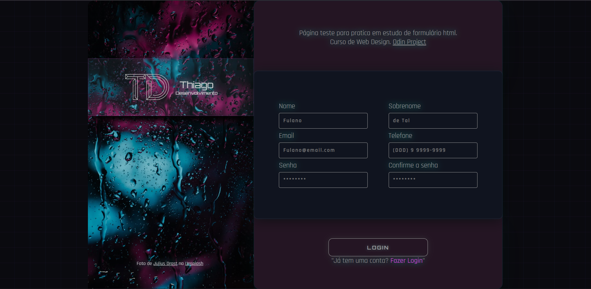

# Formulário de Cadastro — Thiago Dev



## 📋 Descrição

Página de formulário de cadastro desenvolvida como exercício prático do curso **The Odin Project**. O projeto foi construído do zero com foco em aprender HTML e CSS, com um tema visual **dark/neon** personalizado, incluindo layout responsivo para dispositivos móveis.

## 🚀 Tecnologias Utilizadas

- HTML5
- CSS3 (Flexbox, variáveis CSS, media queries, pseudo-elementos)
- Google Fonts (Orbitron, Rajdhani)

## ▶️ Como Rodar o Projeto

1. Clone o repositório:
```
git clone https://github.com/thiagoSantz/Formulario.git
```

2. Acesse a pasta do projeto:
```
cd Formulario
```

3. Abra o arquivo `index.html` no seu navegador.

> Não é necessário instalar nenhuma dependência.

## 👨‍💻 Autor

Feito por **Thiago** durante os estudos de Web Development.
